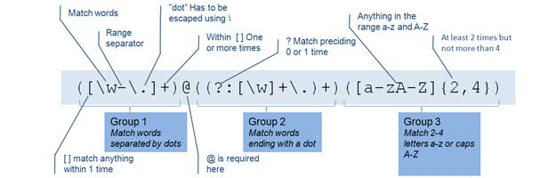
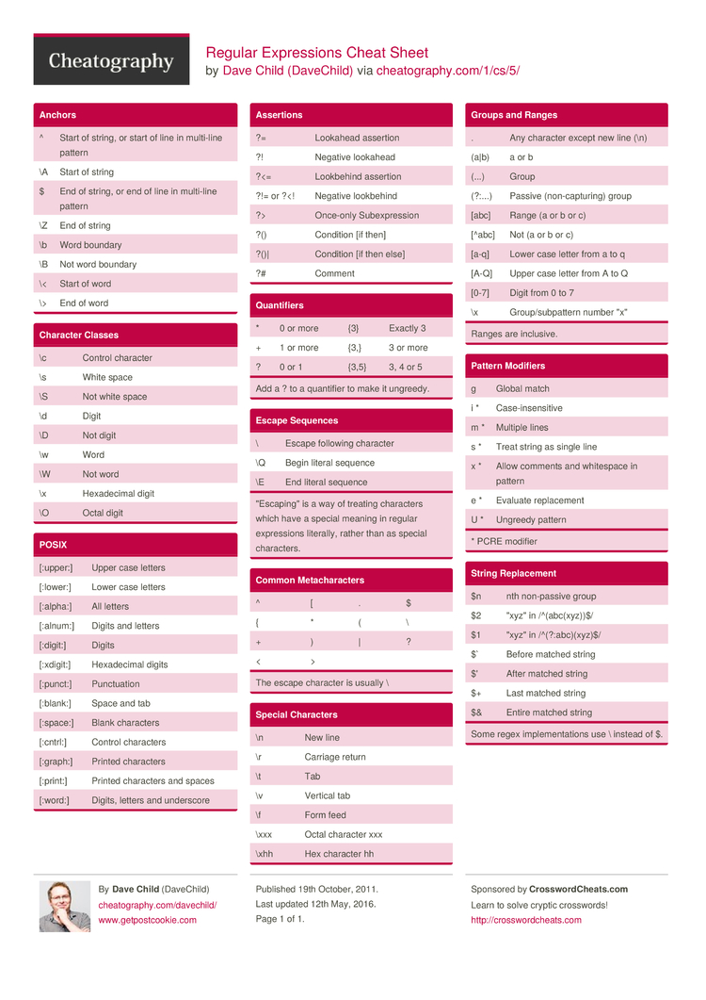

<h1>REGULAR EXPRESSIONS</h1>

<!-- TOC -->

- [Declaration](#declaration)
- [Flags](#flags)
- [Patterns](#patterns)
- [Characters](#characters)
- [Grouping and ranges](#grouping-and-ranges)
- [JavaScript Methods](#javascript-methods)
- [Dave Child Regular Expressions Cheatsheet](#dave-child-regular-expressions-cheatsheet)

<!-- /TOC -->


<!---------------------------------------------------------- DECLARATION ---------------------------------------------------------->
## Declaration
```js
var regexp = /searching/;
var regexp = new RegExp("searching");
```


<!---------------------------------------------------------- FLAGS ---------------------------------------------------------->
## Flags
- **g**: Match all occurences (global)
- **i**: Case insensitive
- **m**: Multiline
- **y**: Sticky, remember the last search
- **s**: treat string as a single line

```javascript
var regexp = /searching/gi;
var regexp = new RegExp("searching", "gi");
```


<!---------------------------------------------------------- PATTERNS ---------------------------------------------------------->
## Patterns



**Basic**
- ab: Literal matching
```js
/Regular/.test("Regular")
```
- .: Matches any character except \n \r \u2028 or \u2029
```js
"That's hot!".match(/Th.t/g)
```
- a|b: Matches with one or the other
```js
/Monday|Tuesday/.test("Monday")
```
- \: Escapes an specific character
```js
/\*/.test("*")
```
**Anchors**
- ^ab: Starting by a string
```js
/^000/g.test("0001 is an id")
```
- ab$: Ending by a string
```js
/ing$/.test("singing")
```
**Quantifiers**
- *: Zero or more ocurrences of the expression before the asterisk
```js
/Ah*/.test("Ahhhhhh!") // A, Ah, Ahh, ...
```
- +: One or more ocurrences of the expression before the asterisk
```js
/Ah+/.test("Ahhhhh!") // Ah, Ahh, Ahhh, ...
```
- ?: Zero or one ocurrence of the character
```js
/Ah?/.test("Ahhhhh!") // A, Ah
```
- **{X,y}**: Matches a set number of times
```js
/[1-9]{2}/.test(12);
/[1-9]{2, 5}/.test(12345);
/[1-9]{2}/.test(123);
```


<!---------------------------------------------------------- CHARACTERS ---------------------------------------------------------->
## Characters
- \d: Number `[0-9]`
```js
"Hi u_123! *.*".match(/\d/g)
```
- \D: Not number and _ `[^0-9]`
```js
"Hi u_123! *.*".match(/\D/g)
```
- \s: White spaces `[\t\r\n\f]`
```js
"Hi u_123! *.*".match(/\s/g)
```
- \S: Not matchs with any white space `[^ \t\r\n\f]`
```js
"Hi u_123! *.*".match(/\S/g)
```
- \w: Alphanumeric characters and _ `[A-Za-z0-9_]`
```js
"Hi u_123! *.*".match(/\w/g)
```
- \W: Not alphanumeric characters and _ `[^A-Za-z0-9_]`
```js
"Hi u_123! *.*".match(/\W/g)
```
- \b: Coincidences at the begining or end of the word
```js
/\bme/.test("minus")
```
- \B: Avoid coincidences at the begining or end of the word
```js
/\Bte/.test("battery")
```
- \n: Matches a line break
```js
/\n/.test("hi!\nNew line")
```
- \r: Matches a return
```js
/\r/.test("hi!\rReturn")
```
- \t: Matches a tabulation
```js
/\t/.test("hi!\tTabulation")
```
- \xxx: Character in octal
```js
/\127/g.test("Website")
```
- \uxxxx: Character in unicode
```js
/\u0057/g.test("Website")
```
- \1: Refers to the first match
```js
/(\w+) \1/.test("the the whatever dog dog")
```


<!---------------------------------------------------------- GROUPS ---------------------------------------------------------->
## Grouping and ranges
- [ab]: Matches at least one character
```js
"Hi... and hi again".match(/[hi]/g)
```
- [^ab]: Should not match with any of these characters
```js
"hi... and ..".match(/[^hi]/g)
```
- [1-9]: Range between 1 and 9
```js
"123610823710932".match(/[1-4]/g)
```
- [a-f]: Range between a and f
```js
"asdjlk3akdsjalsd".match(/[5-8q-zA-C]/g)
```
- (ab): Creates a group
```js
"hi _who are_".replace(/_(.*?)_/, "<strong>$1</strong>")
```
- (?:ab): Group not matched
```js
"foo".match(/(foo){1,2}/)
"foo".match(/(?:foo){1,2}/)
```
- a(?=b): a only if it's followed by b
```js
/Meta(?=character|characters)/.test("Metacharacter")
```
- a(?!b): a only if it's not followed by b
```js
/\d+(?!\.)/.test("3.141")
```


<!---------------------------------------------------------- METHODS ---------------------------------------------------------->
## JavaScript Methods
- **exec:** Returns an array of information
```js
var coincidences = /lorem/.exec("lorem ipsum");
console.log(coincidences[0]); // lorem
```
- **test:** True if there is any coincidence
```js
var coincidences = /lorem/.test("lorem ipsum");
console.log(coincidences); // true
```
- **match:** Returns an array like exec but applys to a string
```js
var content = "lorem ipsum";
var coincidences = content.match(/lorem/);
console.log(coincidences[0]); // lorem
```
- **search:** Returns the index of the coincidence or -1 if it's not founded
```js
var content = "lorem ipsum";
var coincidences = content.search(/ipsum/);
console.log(coincidences); // 6
```
- **replace:** Replaces the substring founded with another string
```js
var content = "lorem ipsum";
var coincidences = content.replace(/rem/, "REM");
console.log(coincidences); // loREM ipsum
```
- **split:** Returns an array of substrings starting from a given pattern
```js
var content = "lorem ipsum";
var coincidences = content.split(/rem/);
console.log(coincidences); // ["lo", " ipsum"]
```

## Dave Child Regular Expressions Cheatsheet

